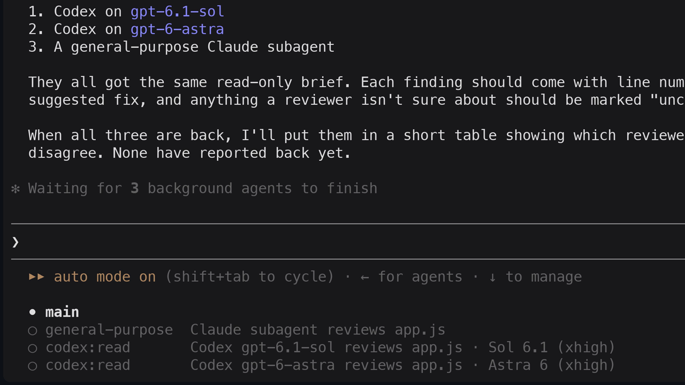
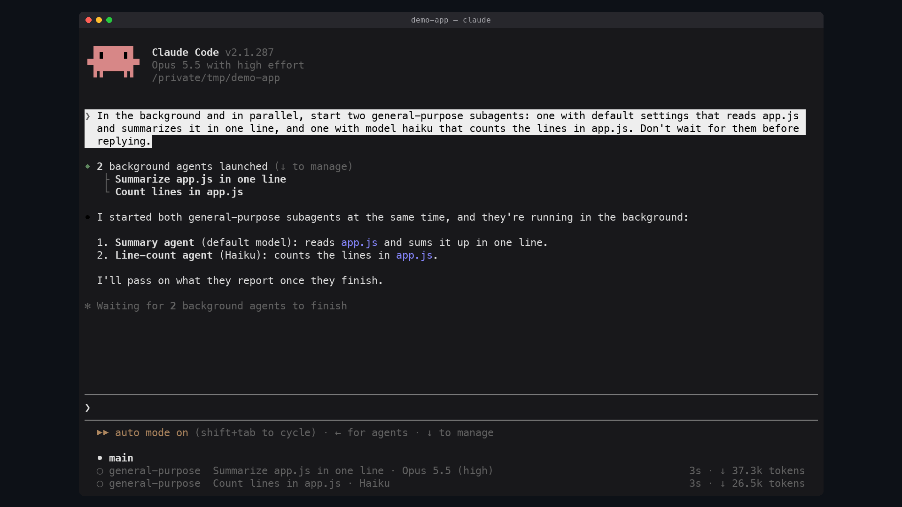

# claude-mods

Mods for [Claude Code](https://code.claude.com/docs/en/plugins/mods/overview):
plugins whose behaviour is a module of function hooks.

| Plugin | What it does | |
| --- | --- | --- |
| [codex](plugins/codex/README.md) | OpenAI Codex as a native Claude Code subagent: in the agent list, messageable, with its model, time and tokens |  |
| [agent-models](plugins/agent-models/README.md) | Each Claude subagent's model and effort in the agent list, e.g. `· Opus 5.5 (high)` |  |

## Install

Add the marketplace once, then install the plugins you want:

```
/plugin marketplace add alex2481kobe/claude-mods
/plugin install codex@claude-mods
/plugin install agent-models@claude-mods
```

Each plugin's README has its requirements and how to use it.

## Layout

```
.claude-plugin/marketplace.json   the plugins this marketplace lists
plugins/<name>/                   one self-contained plugin
  .claude-plugin/plugin.json      its manifest
  hooks/                          its hooks module
  tests/                          its tests
  media/                          its screenshots
  README.md                       its documentation
```

Contributing a plugin: see [AGENTS.md](AGENTS.md).

## License

Apache-2.0
