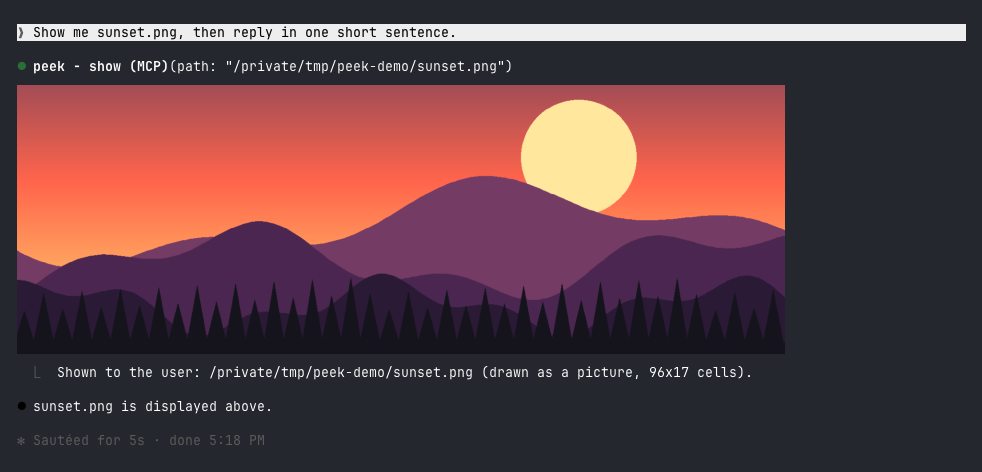
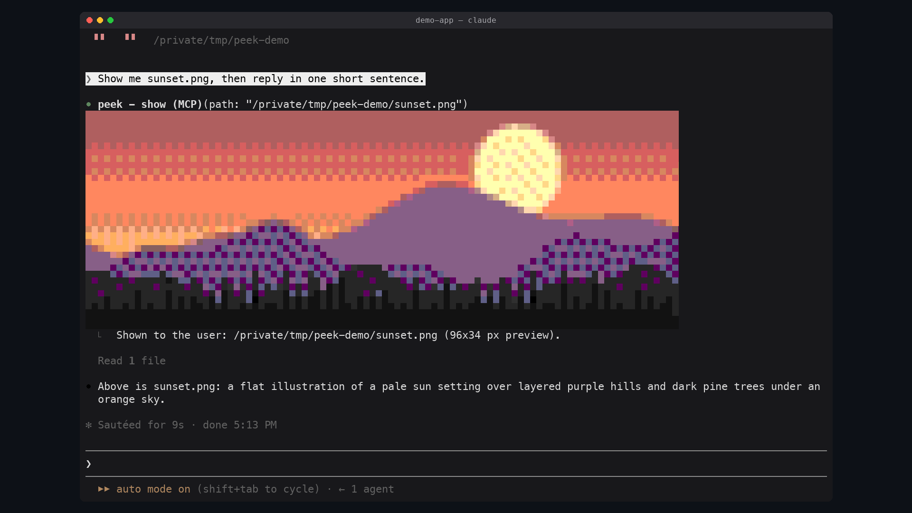

# peek

Images in the terminal. When Claude makes, downloads, captures or finds an
image you should look at, it shows it to you inline, under its tool call,
without you opening a browser or your phone.

In Ghostty or kitty it is the real picture:



In other terminals it is a colored-block preview:



## What you see depends on your terminal

| Terminal | What peek draws |
| --- | --- |
| Ghostty, kitty | The real picture, in pixels |
| Apple Terminal, iTerm2, WezTerm, VS Code's terminal, anything inside tmux | A colored-block preview, about 160x96 pixels at most |
| Claude Code Desktop, the mobile app | Nothing: the tool row only |

The reason is what a terminal can draw. Every terminal draws text: a grid of
cells, each one character with a text and a background color. A real picture
needs the terminal to implement a graphics protocol, a way for a program to
hand it pixels. Claude Code draws a mod's pictures through the kitty graphics
protocol, which kitty and Ghostty implement. Apple Terminal implements none,
and Claude Code does not promise pictures in the others.

Elsewhere peek fakes the picture with text: each cell is an upper half block
`▀` whose text color paints one pixel and whose background paints the one
below it, so a cell holds two pixels. Claude Code draws these in the 256-color
palette even where the terminal has more, so peek picks the palette colors
itself, by how close they look, and lightly dithers between them.

## Requirements

- Claude Code with mods (tested on 2.1.287)
- macOS: images are read and converted with `sips`, which ships with it

## Install

```
/plugin marketplace add alex2481kobe/claude-mods
/plugin install peek@claude-mods
```

## Use

Ask for an image the way you would anyway ("show me the screenshot", "make a
chart of this and let me see it"). Claude calls the `show` tool on its own.

You can also show one yourself:

```
/peek ~/Desktop/screenshot.png
```

Any format macOS opens works: PNG, JPEG, HEIC, GIF, TIFF, BMP.

## How it works

- `$.tool.register` adds the `show` tool (`mcp__peek__show`). Claude Code may
  defer a plugin's tool, which hides its description until it is loaded, so a
  `prompt.compose` hook also adds a short section to the system prompt: to let
  you see an image, call `show`. Reading an image shows it only to Claude.
- In kitty or Ghostty (`TERM_PROGRAM=ghostty`, or `KITTY_WINDOW_ID` set) the
  picture is an `Image` element over a PNG copy of the image in
  `$TMPDIR/peek/`. The terminal reads that file itself at every redraw, and
  Claude Code refuses a file on a network or device path, so the copy keeps the
  picture working when the original moves or lives on a mounted volume.
- Elsewhere `sips` scales the image and writes an uncompressed BMP, which peek
  decodes, fits to the 256-color palette (nearest in CIE Lab, then
  Floyd-Steinberg at a quarter strength) and draws as a `Raster` of half
  blocks.
- A `ui.render` hook on the tool's row, and on `/peek`'s output row, draws the
  picture under it.

The dither strength was measured, not guessed: on live captures of a
256-color terminal, a quarter strength cut the error you see at a glance by
8-22% against no dithering, without the checkerboard that stronger dithering
leaves in this palette.

## Limits

- The block preview is coarse: fine text in a screenshot will not be readable.
- Flat areas in charts and app screenshots get a faint dither pattern.
- Pictures are drawn in the terminal only; the desktop and mobile apps show
  the tool row without the image.
- In tmux the block preview is used even inside Ghostty or kitty.
- In kitty and Ghostty each shown image leaves a PNG copy in `$TMPDIR/peek/`,
  which macOS clears with the rest of the temporary folder.
- macOS only.
- Tried live in Apple Terminal (macOS 15), in a 256-color tmux pane, and in
  Ghostty 1.3.1: PNG, JPEG, HEIC, a 6000x4000 PNG (under half a second), a
  transparent PNG, and 20 images in one session.

## Develop

```sh
claude plugin validate plugins/peek
claude plugin test plugins/peek
claude --plugin-dir plugins/peek
```
