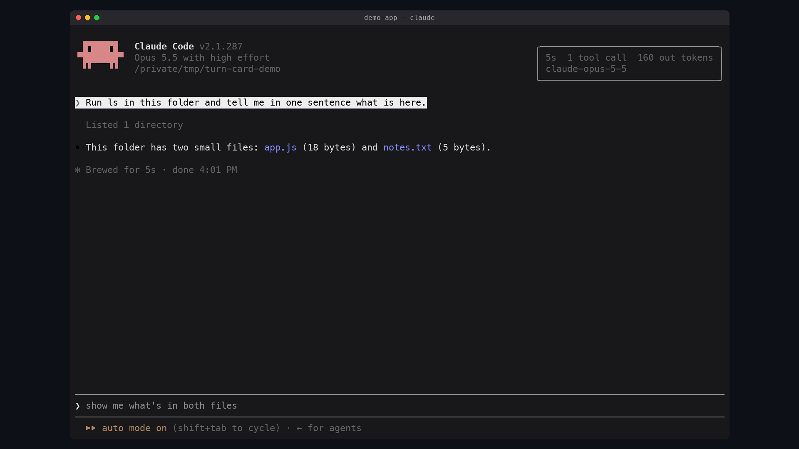

# turn-card

A receipt for each turn, floating over the transcript only while you point at it.

Hover a prompt you typed and a small card appears over the rows above it:

- how long the turn took
- how many tool calls it made
- how many output tokens it wrote
- which model answered



Move the pointer off and it is gone. It takes no rows: no pane, no band above
the prompt, no status line. The card is solid in your terminal's own background
color, so it reads cleanly over the text beneath it.

## Requirements

- Claude Code with mods (tested on 2.1.287)
- The fullscreen terminal layout (`"tui": "fullscreen"`), where the pointer
  reaches the transcript. Elsewhere the mod records turns but draws nothing.

Tried live on: the terminal in its fullscreen layout. Not yet tried: the
terminal's inline layout and the desktop app.

## Install

```
/plugin marketplace add alex2481kobe/claude-mods
/plugin install turn-card@claude-mods
```

## How it works

- `session.append` notes each prompt you type (`origin.kind` `composer`) as the
  turn in flight. Messages from other sessions and task notifications are
  ignored, so one arriving mid-turn cannot take the card over.
- `tool.call` counts the turn's tool calls, a subagent's included.
- `turn.complete` on the main loop keeps the turn's duration, output tokens and
  model under the prompt's transcript id.
- `ui.render` on `UserMessage` draws the engine's own row, then an absolutely
  positioned `Box` hidden with `display: none` that `hover` reveals. Being
  absolute, it paints over the rows above without moving them.

Everything is held in session state (`$.state`), so a reload of the mod during
a turn keeps that turn.

## Limits

- Cards last for the session. Prompts from before the mod loaded, or from an
  earlier session, have none.
- Only typed prompts get a card; a turn started by a peer message or a task
  notification does not.
- The mods API is early access and may change between Claude Code releases.

## Develop

```sh
claude plugin validate plugins/turn-card
claude plugin test plugins/turn-card
claude --plugin-dir plugins/turn-card
```
